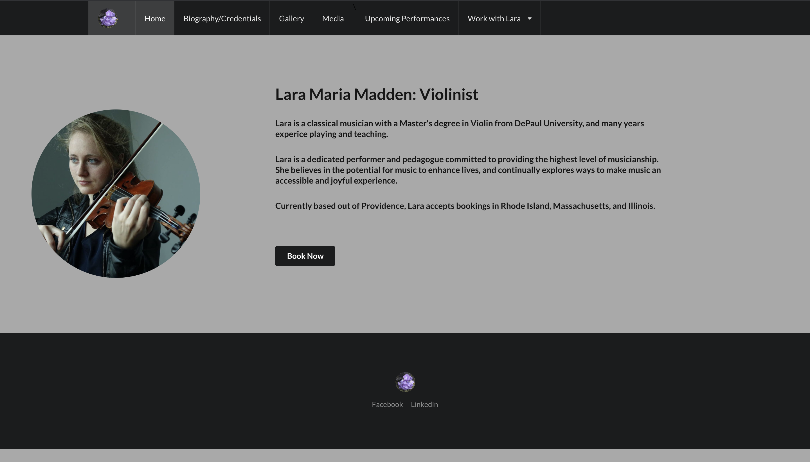

# README

## Lara's Website




### Frontend Repo: https://github.com/maddeno/larasitefrontend

### Demo: https://drive.google.com/open?id=1tj2AR-t9BMg9dqSy0U-fYLffZWxYDoDB

### Technologies: ruby 2.6.1p3, rails 6.0.2.2, actionmailer 6.0.2.2, bcrypt 3.1.7, jwt 2.2


This app is a professional website for my sister, Lara. She is a concert violinist / music teacher, and needed her own website as a promotional tool as well for prospective clients to book gigs or lessons. Functionality is based on Lara's specifications: she wanted to provide users with all the information they would when looking to hire a musician. Forms are available to request bookings, and contain all the relevant input fields for Lara to assess the job. 

This Rails back-end consists of a Postgresql database that stores login data for Lara as well as all of her bookings. Gig and lesson bookings are created based on user input on the frond-end, and are instantiated with a status attribute set to "requested".

When a new gig or lesson is created, ActionMailer relays the details of the booking to the Lara's inbox. The email they receive includes a link back to the "bookings handler" component of the app, which is hidden behind JWT authentication. Upon logging in, Lara can update the status of gigs and lessons to "accepted" or "declined".

Users booking gigs have the option to instantiate their gig as "public". If a gig is both marked "public" by the client and "accepted" by Lara, then the date, time, and location of that gig will be appear in the "Upcoming Performance Calendar" component on the front-end. 

To start, simply run ```rails s```. Follow the link at the top of the Readme to the front-end repo, and start the server by running ```npm start```.